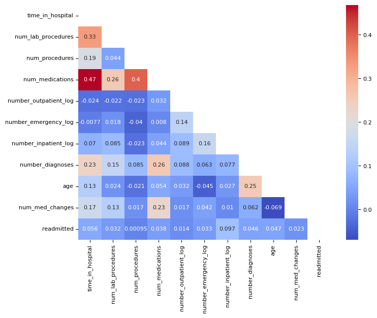
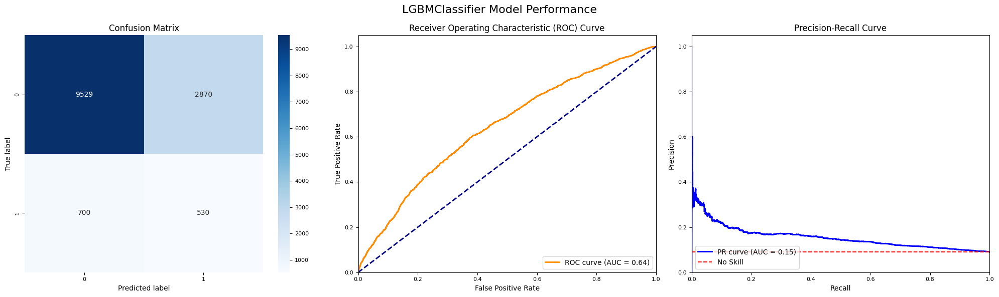
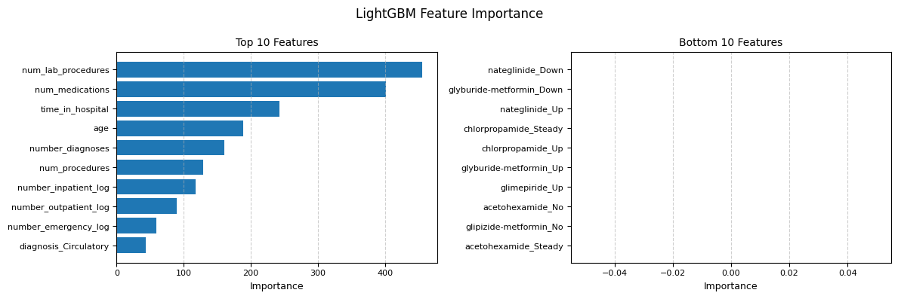

# Key findings:
 # Key findings: Predicting hospital readmissions within 30 days is challenging, with the best model (LightGBM) achieving an Average Precision of 15.7%, but the analysis reveals that the number of previous inpatient visits, number of diagnoses, and length of hospital stay are the strongest predictors of readmission risk.

## Authors

- [@madokahazemi](https://www.github.com/madokahazemi)

## Table of Contents

  - [Business problem](#business-problem)
  - [Data source](#data-source)
  - [Methods](#methods)
  - [Tech Stack](#tech-stack)
  - [Quick glance at the results](#quick-glance-at-the-results)
  - [Lessons learned and recommendation](#lessons-learned-and-recommendation)
  - [Limitation and what can be improved](#limitation-and-what-can-be-improved)
  - [Explore the notebook](#explore-the-notebook)
  - [Repository structure](#repository-structure)
  - [Blog post](#blog-post)

## Business problem

Hospital readmissions within 30 days of discharge are a significant challenge in healthcare, leading to increased costs and potentially indicating gaps in care quality. This project aims to develop a predictive model to identify patients at high risk of readmission, enabling healthcare providers to implement targeted interventions and improve patient outcomes while optimizing resource allocation.


## Data source

- [Diabetes 130-US Hospitals for Years 1999-2008](https://archive.ics.uci.edu/dataset/296/diabetes+130-us+hospitals+for+years+1999-2008)

## Methods

- Exploratory data analysis
- Bivariate analysis
- Multivariate correlation
- Sampling (each model was tested with different sampling techniques to address class imbalance) :
  - No sampling
  - SMOTE
  - Random Undersampling
  - ADASYN
  - SMOTETomek
- Model deployment:
  - Logistic Regression
  - Random Forest
  - XGBoost
  - LightGBM
  - CatBoost


## Tech Stack

- Python (refer to requirement.txt for the packages used in this project)


## Quick glance at the results

Correlation between the features.




Top 3 models (with hypertuned parameters)

| Model     	          |  Sampler               | Average Precision 	 | Recall       	  | AUC score 	| 
|-------------------	  |------------------      |------------------	       |------------------  |------------------	|
| LightGBM              |	None	                 | 15.7% 	                   | 42.8% 	            | 64.1% 	            |
| Logistic Regression   |	Random oversampling    | 14.9% 	                   | 47.6% 	            | 63.6% 	            |
| Random Forest         |	Random undersampling   | 15.5% 	                   | 35.9% 	            | 64.3% 	            |


Model evaluation: Confusion matrix, ROC-Curve and PR-Curve of LightGBM classifier.



Feature importance:



- **The final model used for this project: LightGBM**
- **Metrics used: Average Precision**
- **Why choose Average Precision as metrics**:
Average Precision provides a comprehensive evaluation of the model's performance across all possible classification thresholds. It summarizes the precision-recall curve into a single score, effectively capturing the model's ability to identify true positives (correct readmission predictions) while considering the precision-recall trade-off. This makes Average Precision particularly suitable for our readmission prediction task, where we need to balance the identification of high-risk patients with the efficient use of healthcare resources.


  - ***Note***: There is always a trade-off between precision and recall. Choosing the right balance depends on the specific healthcare context, available resources, and the relative costs of false positives versus false negatives.
    - In a well-resourced healthcare setting, hospitals have ample capacity and resources to handle patient care. The cost of a false positive (incorrectly predicting a readmission) is relatively low compared to the cost of a missed readmission. In this scenario, the hospital can afford to intervene with more patients, even if some of those interventions are unnecessary. Having a good recall (sensitivity) is ideal here, as it ensures that most patients at risk of readmission are identified and receive additional care or follow-up.
    - In a resource-constrained healthcare setting, hospitals have limited capacity and must allocate their resources very carefully. The cost of unnecessary interventions (false positives) becomes more significant. In this case, the hospital needs to be more selective in identifying high-risk patients to ensure that limited resources are used most effectively. Having good precision (specificity) becomes more desirable, as it helps ensure that interventions are targeted at patients who are most likely to be readmitted.

***Conclusion***: Since our primary goal is to minimize the risk of patient readmission and assuming we have adequate resources for follow-up care, we prioritize recall while using Average Precision as our overall metric to balance both precision and recall across different thresholds.


## Lessons learned and recommendation

- Based on this project's analysis, the number of inpatient visits, number of diagnoses, and time in hospital are the three most predictive features in determining whether a patient is likely to be readmitted within 30 days. Other features like age and number of medications are also helpful. The least useful features appear to be gender and some specific diagnosis categories.

- The recommendation would be to focus more on the most predictive features when assessing a patient's risk of readmission. Specifically:

  1. Pay close attention to patients with a history of frequent inpatient visits, as they are at higher risk of readmission.
  2. Consider the complexity of a patient's condition, as indicated by the number of diagnoses, when planning post-discharge care.
  3. Evaluate the length of hospital stay carefully, as longer stays may indicate more complex cases with higher readmission risk.
  4. Take into account the patient's age and the number of medications they're prescribed, as these factors also contribute to readmission risk.


## Limitation and what can be improved

While the model's performance (with an Average Precision of about 15.7% for the best model) indicates the challenging nature of predicting readmissions, it still provides valuable insights for identifying high-risk patients.

- The use of ensemble methods, particularly gradient boosting (LightGBM), proved most effective for this complex problem. This suggests that leveraging multiple weak learners can capture the nuanced patterns in readmission risk better than simpler models.

- The challenge of class imbalance in the dataset highlights the importance of using appropriate evaluation metrics (like Average Precision) and sampling techniques when dealing with healthcare data.

- For future work, consider incorporating more detailed data on post-discharge care plans, patient compliance with treatment, and social determinants of health to potentially improve prediction accuracy.


## Explore the notebook

To explore the notebook file [here](https://github.com/madokahazemi/diabetes-readmission-prediction/blob/main/code/Prediction%20on%20Hospital%20Readmission.ipynb)


## Repository structure


```

├── assets
│   ├── confusion_matrix.png                      <- confusion matrix image used in the README.
│   ├── heatmap.png                               <- heatmap image used in the README.
│   ├── banner.png                                <- banner image used in the README.
│   ├── roc.png                                   <- ROC image used in the README.
│
├── data
│   ├── diabetes_data.csv                    <- the dataset with patient information.
│

├── pandas_profile_file
│   ├── credit_pred_profile.html                  <- exported panda profile html file.
│
│
├── .gitignore                                    <- used to ignore certain folder and files that won't be commit to git.
│
│├── code
│   ├── Prediction on Hosputal Readmission.ipynb         <- main python notebook where all the analysis and modeling are done.
│
│
│
├── README.md                                     <- this readme file.
│
│
├── requirements.txt                              <- list of all the dependencies with their versions.

```


