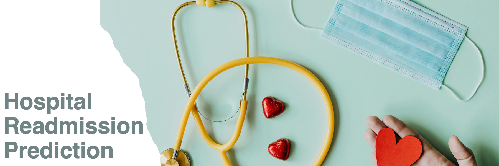

# Key findings:
 # Key findings: Predicting hospital readmissions within 30 days is challenging, with the best model (LightGBM) achieving an Average Precision of 15.7%, but the analysis reveals that the number of previous inpatient visits, number of diagnoses, and length of hospital stay are the strongest predictors of readmission risk.

## Authors

- [@madokahazemi](https://www.github.com/madokahazemi)

## Table of Contents

  - [Business problem](#business-problem)
  - [Data source](#data-source)
  - [Methods](#methods)
  - [Tech Stack](#tech-stack)
  - [Quick glance at the results](#quick-glance-at-the-results)
  - [Lessons learned and recommendation](#lessons-learned-and-recommendation)
  - [Limitation and what can be improved](#limitation-and-what-can-be-improved)
  - [Explore the notebook](#explore-the-notebook)
  - [Repository structure](#repository-structure)
  - [Blog post](#blog-post)

## Business problem

Hospital readmissions within 30 days of discharge are a significant challenge in healthcare, leading to increased costs and potentially indicating gaps in care quality. This project aims to develop a predictive model to identify patients at high risk of readmission, enabling healthcare providers to implement targeted interventions and improve patient outcomes while optimizing resource allocation.


## Data source

- [Diabetes 130-US Hospitals for Years 1999-2008](https://archive.ics.uci.edu/dataset/296/diabetes+130-us+hospitals+for+years+1999-2008)

## Methods

- Exploratory data analysis
- Bivariate analysis
- Multivariate correlation
- Sampling (each model was tested with different sampling techniques to address class imbalance) :
  - No sampling
  - SMOTE
  - Random Undersampling
  - ADASYN
  - SMOTETomek
- Model deployment:
  - Logistic Regression
  - Random Forest
  - XGBoost
  - LightGBM
  - CatBoost


## Tech Stack

- Python (refer to requirement.txt for the packages used in this project)


## Quick glance at the results

Correlation between the features.


Top 3 models (with hypertuned parameters)

| Model     	          |  Sampler               | Average Precision 	 | Recall       	  | AUC score 	| 
|-------------------	  |------------------      |------------------	       |------------------  |------------------	|
| LightGBM              |	None	                 | 15.7% 	                   | 42.8% 	            | 64.1% 	            |
| Logistic Regression   |	Random oversampling    | 14.9% 	                   | 47.6% 	            | 63.6% 	            |
| Random Forest         |	Random undersampling   | 15.5% 	                   | 35.9% 	            | 64.3% 	            |


Model evaluation: Confusion matrix, ROC-Curve and PR-Curve of LightGBM classifier.


Feature importance:


- **The final model used for this project: LightGBM**
- **Metrics used: Average Precision**
- **Why choose Average Precision as metrics**:
Average Precision provides a comprehensive evaluation of the model's performance across all possible classification thresholds. It summarizes the precision-recall curve into a single score, effectively capturing the model's ability to identify true positives (correct readmission predictions) while considering the precision-recall trade-off. This makes Average Precision particularly suitable for our readmission prediction task, where we need to balance the identification of high-risk patients with the efficient use of healthcare resources.


  - ***Note***: There is always a trade-off between precision and recall. Choosing the right balance depends on the specific healthcare context, available resources, and the relative costs of false positives versus false negatives.
    - In a well-resourced healthcare setting, having a good recall (sensitivity) is ideal, as it ensures that most patients at risk of readmission are identified and receive additional care.
    - In a resource-constrained healthcare setting, In this case, the hospital needs to be more selective in identifying high-risk patients to ensure that limited resources are used most effectively. Having good precision (specificity) becomes more desirable, as it helps ensure that interventions are targeted at patients who are most likely to be readmitted.


***Conclusion***: Since our primary goal is to minimize the risk of patient readmission and assuming we have adequate resources for follow-up care, we prioritize recall while using Average Precision as our overall metric to balance both precision and recall across different thresholds.


## Lessons learned and recommendation

- Based on this project's analysis, the number of inpatient visits, number of diagnoses, and time in hospital are the three most predictive features in determining whether a patient is likely to be readmitted within 30 days. Other features like age and number of medications are also helpful. The least useful features appear to be gender and some specific diagnosis categories.

- Recommendations:
  - Focus on patients with frequent inpatient visits and complex diagnoses.
  - Consider longer hospital stays as potential indicators of higher readmission risk.
  - Factor in patient age and number of prescribed medications when assessing risk.
  - Pay less attention to factors like gender and specific diagnosis categories, which showed less predictive power.


## Limitation and what can be improved

While the model's performance (with an Average Precision of about 15.7% for the best model) indicates the challenging nature of predicting readmissions, it still provides valuable insights for identifying high-risk patients.

For future work:
  - Retrain the model without the least predictive features and apply more advanced feature selection methods, such as recursive feature elimination or LASSO regularization to potentially improve performance and reduce noise.
  - Experiment with more advanced feature engineering techniques, such as polynomial features or interaction terms.
  - Explore deep learning models, particularly recurrent neural networks (RNNs) or transformers, to capture temporal patterns in patient history.
  - Implement more sophisticated ensemble methods, such as stacking or blending multiple models.
  - Try advanced sampling techniques to better handle class imbalance.


## Explore the notebook

To explore the notebook file [here](https://github.com/madokahazemi/diabetes-readmission-prediction/blob/main/code/Prediction%20on%20Hospital%20Readmission.ipynb)


## Repository structure


```

├── assets
│   ├── Banner.png                                 <- banner image used in the README.
│   ├── EDA_heatmap.png                            <- heatmap image used in the README.
│   ├── LightGBM_evaluation.png                    <- model evaluation image used in the README.
│   ├── LightGBM_FeatureImportance.png             <- feature importance image used in the README.
│
├── data
│   ├── diabetes_data.csv                          <- the dataset with patient information.
│
│├── code
│   ├── Prediction on Hosputal Readmission.ipynb   <- main python notebook where all the analysis and modeling are done.
│
│
│├── .gitignore                                    <- used to ignore certain folder and files that won't be commit to git.
│
├── poetry.lock                                    <- detailed, pinned dependency specifications for Poetry.
│
├── pyproject.toml                                 <- configuration file for Poetry, defining project metadata and dependencies.
│
├── README.md                                      <- this readme file.
│
├── requirements.txt                               <- list of all the dependencies with their versions.


```


